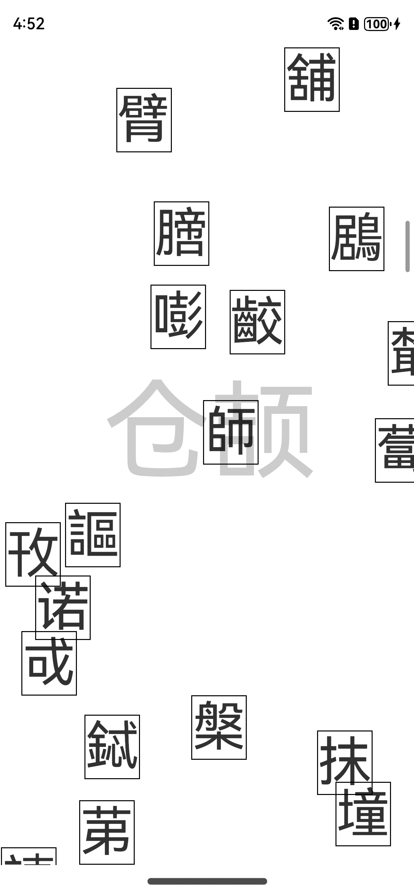

# 造字的仓颉

> 仓颉语言团队 刘俊杰

《说文解字序》有言曰：“仓颉之初作书，盖依类象形，故谓之文；其后形声相益，即谓之字。文者，物象之本，字者，言孳乳而浸多也”。

《文心雕龙》亦有一言：“文之为德也大矣，与天地并生者何哉......（人）为五行之秀，实天地之心，心生而言立，言立而文明，自然之道也”。

这两段话简明概括了语言自身的体用关系——文字和语法为体，由生生之心缀句成文、化为无穷妙用。显然，“用”是目的和意义所在。在计算机中，编程语言同样只是本体或工具，有了开发者的灵巧匠心和辛勤耕耘，才雕琢出诸多高价值应用，构筑起一个欣欣向荣的软件世界。但不同于演化较慢的自然语言，我们可以不断设计和创造新的编程语言，这里就有一个根本问题——设计新语言的依据或目的是什么？实际上，根据中国哲学“体用不二”的思想，我们可以从语言之应用来引导语言之设计，体不离用，不在纯语言理论中空转，而是始终瞄准开发过程的问题和难点、关注新的应用形态和开发模式，从中获取重塑语言的方向与要素，协助开发者更好地表达和构造。此外，正如中国的华美篇章离不开音形意俱佳的汉字，编程语言设计也有必要做美学乃至艺术的考量，这会直接影响开发者的使用体验，程序在运行时虽机械无声，但在编码者心中或许能流通有情？基于这样一些设计理念，我们为开发者带来了新一代应用编程语言——**仓颉**

### 效果预览

