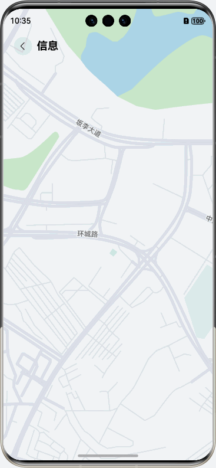

# 底部抽屉滑动效果
## 介绍
船舶信息侧边栏应用是一个基于仓颉编程语言开发的HarmonyOS应用，实现了船舶信息展示和侧边栏滑动交互效果。
应用采用现代化的UI设计，提供船舶AIS信息、微档案和气象信息的查看功能，支持侧边栏滑动显示和隐藏操作。
本示例基于仓颉语言的Stack布局、RelativeContainer和List组件实现了侧边栏滑动效果和船舶信息展示功能。

## 效果预览


## 使用说明
1. 点击"信息"按钮显示底部抽屉，展示船舶详细信息
2. 在主界面可以查看船舶基本信息和当前航次
3. 点击侧边栏可以查看详细的AIS信息、微档案和气象信息
4. 侧边栏支持手势滑动关闭
5. 点击侧边栏外的遮罩区域可以关闭侧边栏
6. 底部操作栏提供关注、提醒、航次等功能按钮

## 实现思路
1. **主界面布局**：使用 `Stack` 和 `RelativeContainer` 实现层叠布局，支持侧边栏覆盖显示
2. **状态管理**：使用 `@State` 装饰器管理界面显示状态（`isShow`、`isShowDown`等）
3. **手势交互**：通过 `onTouch` 事件监听实现左滑关闭侧边栏功能
4. **组件化设计**：将界面拆分为多个可复用组件（`MyTop`、`ShipImg`、`MsgItem`等）
5. **数据管理**：使用 `ArrayList` 存储和管理船舶信息数据

## 工程目录

```
├──entry/src/main/cangjie                           // 代码区
│   ├── index.cj                                    // 应用入口主页面
│   ├── components/                                 // UI组件目录
│   │   ├── BottomTab.cj                            // 底部操作栏组件
│   │   ├── GroupItem.cj                            // 分组项目组件
│   │   ├── MsgItem.cj                              // 消息项目组件
│   │   ├── MyTop.cj                                // 顶部导航组件
│   │   ├── ShipDirection.cj                        // 船舶航向组件
│   │   ├── ShipFact.cj                             // 船舶基本信息组件
│   │   ├── ShipImg.cj                              // 船舶图片组件
│   │   └── StatusHead.cj                           // 状态头部组件
│   └── datas/                                      // 数据文件目录
│       ├── MiniData.cj                             // 微档案数据
│       ├── MsgData.cj                              // AIS信息数据
│       └── WeatherData.cj                          // 气象信息数据
└──entry/src/main/resources                         // 应用资源目录
```

## 主要组件说明

### EntryView (index.cj)
- 应用主入口组件
- 管理侧边栏显示状态
- 处理手势交互和点击事件
- 集成各个子组件

### MyTop
- 顶部导航栏组件
- 包含返回按钮和标题
- 支持底部抽屉弹出功能

### ShipImg
- 船舶图片展示组件
- 包含关闭按钮
- 支持点击关闭侧边栏

### MsgItem
- 信息展示组件
- 支持展开/收起动画
- 动态显示不同类型的船舶信息

### BottomTab
- 底部操作栏组件
- 包含关注、提醒、航次等功能按钮
- 自定义按钮样式

## 功能特性
- ✅ 侧边栏滑动动画
- ✅ 响应式手势操作
- ✅ 组件化的UI设计
- ✅ 自适应布局