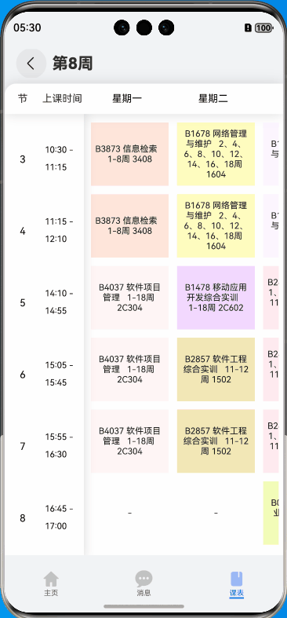

# 双向滚动课程表

## 介绍

本示例是基于仓颉编程语言实现的双向滚动课程表，是教育类行业实践中的典型场景之一。通过使用仓颉语言的组件系统，实现了课程表横向和纵向滚动的功能。

## 效果预览




## 实现思路
1. 页面分为三部分：顶部导航栏、左侧课程节数和时间、右侧星期数和课程数据
2. 使用仓颉语言的Scroll组件实现双向滚动： 
   1. 右侧课程数据使用双层Scroll实现左右滑动 
   2. 通过onScrollFrameBegin回调同步滚动位置
3. 页面初始化时自动定位到当前星期

## 功能特性
- ✅ 横向星期滚动
- ✅ 纵向课程节次滚动
- ✅ 滚动位置同步
- ✅ 自动定位当前星期
- ✅ 响应式布局

## 工程目录

```
├──entry/src/main/cangjie               // 代码区
│  ├──components               
│  │  └──BackRow.cj                     // 返回+第几周
│  │  └──Course.cj                      // 课程内容组件
│  │  └──SectionRow.cj                  // 课程表头部组件
│  │  └──SectionTime.cj                 // 节数和时间组件
│  ├──dataModel                
│  │  └──CourseItem.cj                  // 课程数据模型      
│  └──index.cj                          // 主页面
└──entry/src/main/resources             // 应用资源目录

