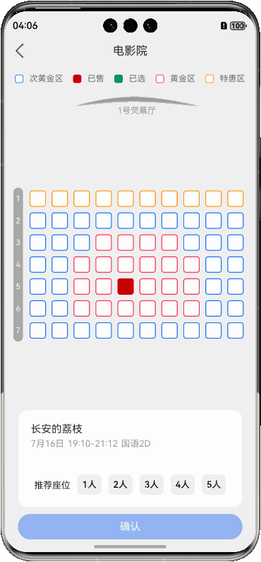

# 电影选座示例

>**made by** 林子淇

本项目是 HarmonyOS 官方 [电影选座 ArkTS 示例](https://developer.huawei.com/consumer/cn/doc/architecture-guides/canvas_cinema-0000002272398929) 的仓颉语言重写版本。旨在演示如何使用仓颉鸿蒙构建一个功能完整的电影选座应用场景。

电影选座是便捷生活类应用中的典型交互场景。用户可以直观地看到影厅的座位布局，根据座位的不同类型（如黄金区、特惠区）进行选择。用户可以点击座位进行选择、再次点击取消选择，并在底部信息卡片中看到已选座位的列表，最后进行确认。

在仓颉鸿蒙开发方面，本项目旨在清晰地演示声明式UI的两个关键概念：

1. 状态驱动UI更新：通过 `@Observed` 和 `@Publish` 宏，实现数据状态与UI视图的自动同步。
2. 组件间状态共享：利用 `LocalStorage` 机制，让分散在不同组件中的UI元素能够安全、高效地共享和响应同一份数据源。

在此基础上，您可以参考[股市图表](../15-StockChart/README.md)示例，它将声明式UI与命令式UI作对比，增强了对 `Canvas` 组件的命令式绘图控制和数据交互的演示，实现了更复杂的 `Canvas` 组件的使用场景。

## 效果预览



## 实现思路

项目整体遵循了经典的 **MVVM (Model-View-ViewModel)** 架构模式，确保了UI、状态和业务逻辑的清晰分离。

### 1. 状态管理与组件间共享

在声明式UI编程中，我们不直接操作UI组件，而是通过改变状态来驱动UI的自动更新，即 `view = f(state)`，其中 `f` 由框架实现，并向开发者隐藏。

- **使用 `@Observed` 和 `@Publish` 声明状态**

    UI的“长相”完全由数据状态决定。当数据变化时，UI会自动刷新以匹配新的数据。

    1. **状态定义**: 在 `SeatSelection.cj` (ViewModel) 中，我们将整个类标记为 `@Observed`，使其成为一个可观察的数据源。其中，直接影响UI呈现的 `seatsState`（座位图状态）和 `selectedSeats`（已选座位列表）两个变量，我们使用 `@Publish` 宏进行标记。这意味着任何对这两个变量的修改都将被UI框架侦听。
    2. **状态消费**: 在UI组件中，我们直接使用这些状态来构建界面。例如，`SeatSelectionBar.cj` 组件根据 `viewModel.selectedSeats` 数组的大小来决定显示“推荐座位”还是已选座位列表。同样，`Card.cj` 中的“确认”按钮也通过 `.enabled(viewModel.selectedSeats.size > 0)` 来动态控制其是否可点击。
    3. **自动更新**: 当用户点击座位，ViewModel 更新了 `selectedSeats` 数组（比如，向其中添加一个座位）后，仓颉的UI框架会自动检测到变化，并重新渲染所有依赖 `selectedSeats` 的UI部分。开发者**无需编写任何手动刷新UI的代码**。

    ```cangjie
    // entry/src/main/cangjie/view_model/SeatSelection.cj
    @Observed
    public class SeatSelection {
        // @Publish 标记此状态的变更需要通知UI
        @Publish public var seatsState: ObservedArrayList<ObservedArray<SEAT_TYPE>> = ...
        @Publish public var selectedSeats: ObservedArrayList<SeatInfo> = ObservedArrayList<SeatInfo>()
        // ...
    }
    
    // entry/src/main/cangjie/components/SeatSelectionBar.cj
    @Component
    public class SeatSelectionBar {
        @LocalStorageLink['viewModel'] // 链接到共享的状态
        var viewModel: SeatSelection = SeatSelection()

        func build() {
            // UI直接消费状态，根据数组大小决定显示内容
            if (viewModel.selectedSeats.size == 0) {
                Text("推荐座位")
                // ...
            } else {
                ForEach(viewModel.selectedSeats, { seat: SeatInfo, _: Int64 =>
                    SelectedSeat(seatInfo: seat)
                })
            }
        }
    }
    ```

- **使用 `LocalStorage` 实现状态共享**

    为了让 `SeatCanvas`、`SeatSelectionBar`、`Card` 等多个独立的组件能访问和修改**同一个** `SeatSelection` 实例，我们使用了 `LocalStorage`。

    1. **创建存储**: 在应用的入口 `index.cj` 中，我们创建了一个 `LocalStorage` 实例，并将其与根组件 `EntryView` 关联。
    2. **链接状态**: 在需要访问共享状态的子组件中，我们使用 `@LocalStorageLink['viewModel']` 宏来获取 `LocalStorage` 中名为 'viewModel' 的数据对象。这确保了所有组件操作的都是**同一个** ViewModel 实例，从而实现了状态的全局共享。

    ```cangjie
    // entry/src/main/cangjie/index.cj
    let storage = LocalStorage() // 1. 创建存储实例
    
    @Entry[storage] // 2. 与根组件关联
    @Component
    class EntryView {
        // ...
    }
    
    // entry/src/main/cangjie/components/Card.cj
    @Component
    public class Card {
        // 3. 在子组件中通过名称链接到该状态
        @LocalStorageLink['viewModel']
        var viewModel: SeatSelection = SeatSelection()
        // ...
    }
    ```

### 2. 核心交互的数据流

理解用户点击一个座位后发生的事情，是理解本项目数据流的关键。这个过程巧妙地结合了**命令式UI**（手动绘制Canvas）和**声明式UI**（自动更新组件）的优点。

1.  **用户操作**: 用户在 `SeatCanvas` 组件上点击。
2.  **事件处理**: `Canvas` 的 `onClick` 事件被触发，调用 `viewModel.handleCanvasClick(evt)`。
3.  **ViewModel 状态更新**:
    *   `handleCanvasClick` 方法计算出用户点击的是哪个座位（行和列）。
    *   它接着调用 `handleSeatClick(seatInfo)`，这是核心的业务逻辑。
    *   `handleSeatClick` 方法会修改两个核心状态：
        1.  更新 `seatsState` 数组，将被点击座位的状态改为 `SELECTED` 或改回原始状态。
        2.  更新 `selectedSeats` 列表，添加或移除对应的 `SeatInfo`。
4.  **UI 响应**:
    *   **命令式更新 (Canvas)**: ViewModel 在更新完状态后，会调用一个预先注册的回调函数 `onStateChangeCallback`。`SeatCanvas` 组件在初始化时将自己的 `drawSeat` 方法注册为这个回调。因此，ViewModel 的调用会让 `SeatCanvas` 对指定的座位进行重绘。
    *   **声明式更新 (其他组件)**: 与此同时，由于 `@Publish` 标记的 `selectedSeats` 数组发生了变化，UI框架会**自动地**重新渲染所有依赖它的组件。这包括：
        *   `SeatSelectionBar` 会从“推荐座位”视图切换到已选座位列表。
        *   `Card` 组件中的“确认”按钮会根据 `selectedSeats` 是否为空，自动变为可用或禁用状态。

通过这种方式，应用实现了高效和易于维护的完美结合：对于复杂的、需要精细控制的 `Canvas` 采用手动重绘，而对于常规的UI组件则充分享受声明式编程带来的便利。

## 工程目录

```
├── entry/src/main/cangjie
│   ├── MainAbility.cj
│   ├── AbilityStage.cj
│   ├── index.cj
│   ├── constants                   // 常量
│   │   ├── AreaInfo.cj
│   │   ├── DataConstants.cj
│   │   ├── SeatInfo.cj
│   │   ├── SeatType.cj
│   │   └── StyleConstants.cj
│   ├── view_model                  // 视图模型
│   │   └── SeatSelection.cj
│   └── components                  // UI组件
│       ├── Card.cj
│       ├── MovieInfo.cj
│       ├── MyDialog.cj
│       ├── SeatCanvas.cj           // 核心的座位图Canvas组件
│       ├── SeatMap.cj
│       ├── SeatSelectionBar.cj     // 底部已选座位/推荐座位滚动条
│       ├── SelectedSeat.cj
│       ├── tag.cj
│       └── title.cj
└── entry/src/main/resources        // 应用资源目录
```