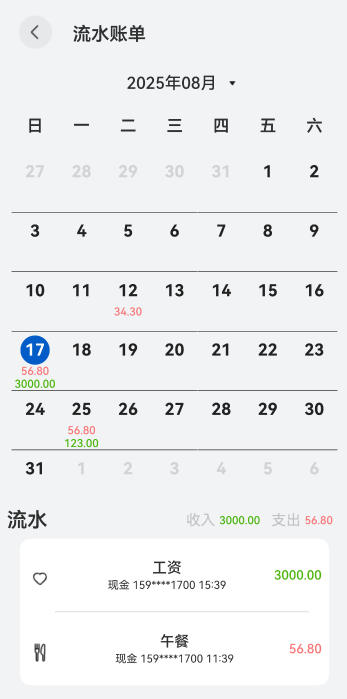

# 每日收支日历图

## 环境要求
- DevEco Studio(含Cangjie支持)
- 鸿蒙应用开发基础环境
- 项目已有Resource

## 预览图

## 场景介绍
每日收支日历图是理财保险类应用中高频使用场景之一，如用户在日历上查看每日股票证券、基金期货等收支情况。

## 使用说明
点击日历网格，即可在下方看到当日流水详细信息
点击日期选择器也可

## 难点与踩坑记录

- 响应式刷新选中态
- 日期网格补齐
- 补齐格点击后的月份切换

## 拆分
### ui
- TopBar
- MonthPicker
- WeekHeader
- MonthGrid (未拆分，经评估拆分后更冗杂)
- SummaryBar
- DetailList

