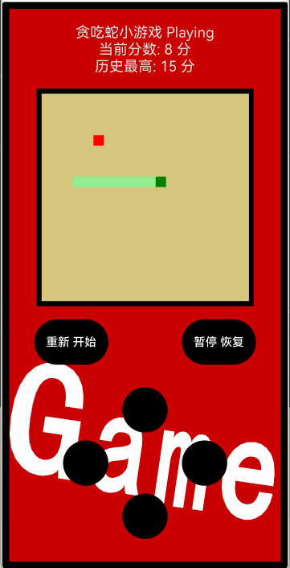

# 贪吃蛇小游戏(WebView + 仓颉)
> 作者: cthree2004
## 效果预览
实现一个SUP游戏机风格的界面，复刻经典的贪吃蛇游戏

## 主要设计
1. 本 Demo 主要演示在仓颉工程中引入Web端代码，并与仓颉进行交互，提高开发的灵活性
2. 使用 html、css、js 实现游戏绘制与运行逻辑，并保存在仓颉工程资源目录中
3. 基于仓颉 Web 组件，实现网页浏览功能，使用 ohos.web.webview 接口，实现与游戏端JS交互 —— 双向调用与数据传递，具体包括：
    - 使用仓颉调用 Js 函数，实现通过仓颉 button 组件控制游戏运行，并获取游戏数据，如 __历史记录__
    - 绑定仓颉方法到 js 对象，通过 js 调用仓颉方法，实现更新游戏数据 __当前游戏状态__、__当前分数__ 等