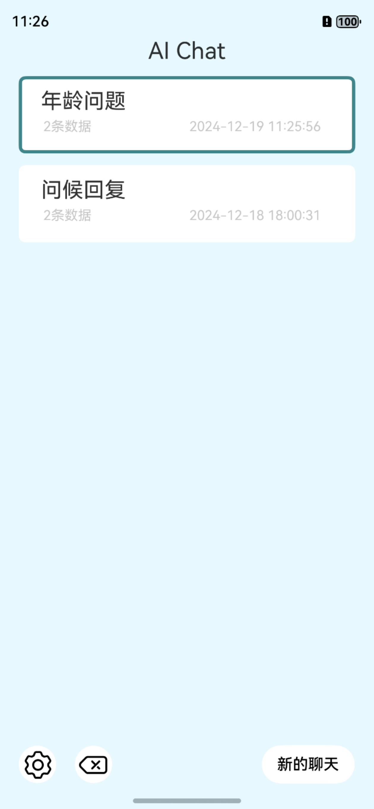
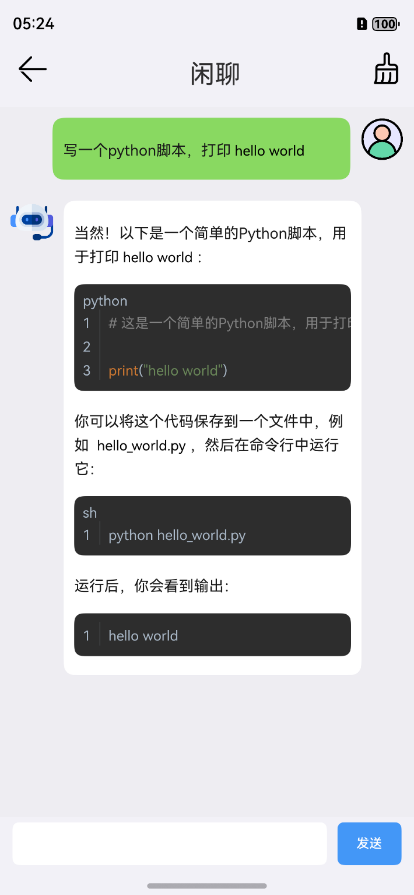
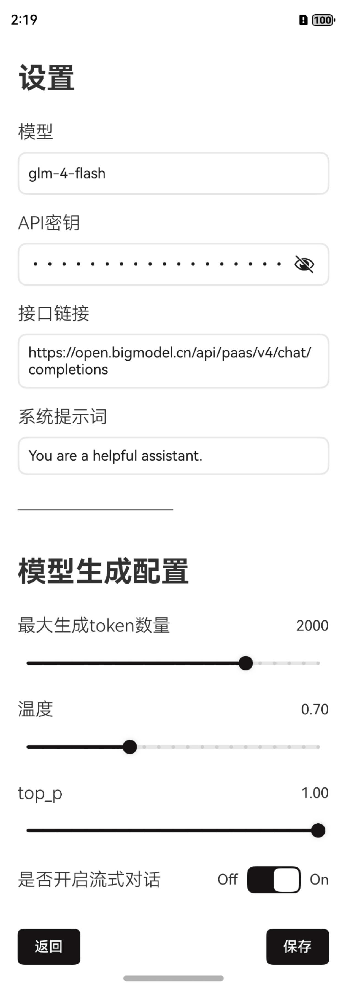
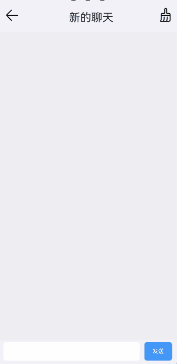

### 项目介绍
### 项目概述
- 使用CangJie编程语言对接OpenAI或者其他兼容OpenAI的接口，完成聊天相关服务。
- 仅支持鸿蒙Next(API 17及以上)。
- 聊天界面UI参考了[QQ UI项目](https://gitcode.com/Cangjie/HarmonyOS-Examples/tree/main/QQUI)，设置界面也同样由[QQ UI项目](https://gitcode.com/Cangjie/HarmonyOS-Examples/tree/main/QQUI)的作者进行优化。
- 主要测试了[One-API](https://github.com/songquanpeng/one-api)服务提供的接口，以及清华智谱的`glm-4-flash`免费模型，阿里云灵积服务的qwen-max，其他openai兼容格式的模型应该问题不大。
- 下面是一个智谱的模型配置文件参考：
```json
{
    "model": "glm-4-flash",
    "api_key": "315xxxxxxxxxxxxxxxxxxxxxxxxxxxxxxxxxxxxxxxx",
    "base_url": "https://open.bigmodel.cn/api/paas/v4/chat/completions",
    "system_prompt": "You are a helpful assistant."
}
```
- 下面是一个普通的[One-API](https://github.com/songquanpeng/one-api)服务的模型配置文件参考
```bash
{
    "model": "qwen1.5-32b",
    "api_key": "sk-xxxxxxxxxxxxxxxxxxxxxxxxxxxxxxxxxxxxxxxx",
    "base_url": "http://192.168.x.x:3000/v1/chat/completions",
    "system_prompt": "You are a helpful assistant."
}
```
- 下面是一个阿里云灵积服务的模型配置参考，更多模型配置可以参考其[官方文档](https://help.aliyun.com/zh/dashscope/developer-reference/compatibility-of-openai-with-dashscope)
```json
{
    "model": "qwen-max",
    "api_key": "sk-xxxxxxxxxxxxxxxxxxxxxxxxxxxxxxxxxxxxxxxxxxxxxxxxxxxxx",
    "base_url": "https://dashscope.aliyuncs.com/compatible-mode/v1/chat/completions",
    "system_prompt": "You are a helpful assistant."
}
```

### 编译说明
- 默认配置是给模拟器的，如果要编译到手机，需要手机打开开发者模式（点击版本号5次左右，然后提示是否打开开发者模式，首次打开会提示需要重启手机）
- 打开开发者模式后，需要打开USB调试（设置-系统-开发者选项-USB调试）
- 然后还需要注释`entry/build-profile.json5`里面的`"abiFilters": ["x86_64"]`，否则手机打开app会闪退。
  - 注释前
  ```json5
  {
      "apiType": "stageMode",
      "buildOption": {
        "cangjieOptions": {
          "path": "./src/main/cangjie/cjpm.toml",
          "abiFilters": ["x86_64"]
        }
      },
      "buildOptionSet": [
      ],
      "targets": [
        {
          "name": "default"
        }
      ]
    }
  ```
  - 注释后
  ```json5
  {
      "apiType": "stageMode",
      "buildOption": {
        "cangjieOptions": {
          "path": "./src/main/cangjie/cjpm.toml",
          // "abiFilters": ["x86_64"]
        }
      },
      "buildOptionSet": [
      ],
      "targets": [
        {
          "name": "default"
        }
      ]
    }  
  ```
- 依赖[markdown4cj](https://gitcode.com/Cangjie-TPC/markdown4cj) 组件，需要在本项目执行下面代码拉取该仓库，看readme，我们需要找一个支持x86_64模拟器的版本，所以选择`md_ai_x86`这个分支，如果是真机运行，则建议选择`develop`分支。
```bash
# 模拟器
git clone https://gitcode.com/Cangjie-TPC/markdown4cj.git -b md_ai_x86

# 真机
git clone https://gitcode.com/Cangjie-TPC/markdown4cj.git -b develop
```
- 注释markdown/src/main/cangjie/src/components/markdown_component.cj下面的一行代码
```cangjie
// 设置组件自身的宽度
// .width(100.percent)
```

### 代码文件说明
- 所有仓颉代码均储存在`entry/src/main/cangjie`目录
- `src/components`一些基础UI组件，参考自[QQ UI项目](https://gitcode.com/Cangjie/HarmonyOS-Examples/tree/main/QQUI)
- `src/utils`（待补充）
- `src/view/chat_line.cj`用来控制人和机器人对话行的UI生成，机器人对话在左边，人对话在右边。
- `src/ability_stage.cj`仓颉插件自动生成的，大概是生命周期管理的东东，可以忽略，一般不需要做修改。
- `src/chat.cj`使用仓颉进行AI聊天的后端组件，基本从纯后端的[AI Chat](https://gitcode.com/Cangjie/Cangjie-Examples/tree/0.53.13/AIChat)项目搬运而来。
- `src/chat_view.cj`聊天界面UI开发，包含流和非流
- `src/env_info.cj`环境配置相关
- `src/main_ability`仓颉插件自动生成的，主生命周期函数，决定哪个Entry为主入口，有时候需要小改一下。
- `src/main_view.cj`主界面UI开发，包含历史聊天会话的管理，删除，新增。
- `src/settings.cj`设置界面UI开发

### 成果展示

- 应用图标（由[aiappicongenerator.com](https://aiappicongenerator.com/)生成）


| 主页  | 聊天页 | 设置页   | 
| ------------ |----------------------| ------------ |

### 对话演示


### 更新日志（2024-12-18）
- 增加一个主页面，用于管理多次对话，支持点击会话框跳转聊天页面，支持会话时间和会话条数统计。
- 支持主页面和对话页面数据持久化储存
- 聊天界面支持会话总结功能，总结后自动添加到顶部标题页。
- 更换新的应用图标，由[aiappicongenerator.com](https://aiappicongenerator.com/)生成
- 设置界面，保存配置时，进行一次校验。
- 更新应用版本号为1.1.0

### 更新日志（2025-06-11）
- 支持markdown渲染
- 修复一些bug
- 注：代码在DevEco Studio for Windows 5.0.13.200和DevEco Studio-Cangjie Plugin 5.0.13.200 完成编译。

