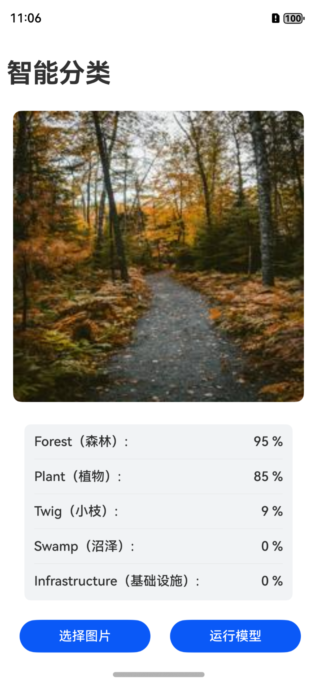

### 项目介绍
- Cangjie在鸿蒙next app开发时，调用mindspore-lite C库对MobieNetV2模型进行推理。
- 该项目参考了鸿蒙官方仓库[MindSporeLiteArkTS](https://gitee.com/harmonyos_samples/MindSporeLiteArkTS)
- 该程序演示了仓颉完成图库授权访问的相关代码

### 准备工作
1. 由于需要文件和图片读取权限，所以需要对程序进行签名，签名方法：打开左上角`文件`-`项目结构`-`Signing Configs`- 勾选`Automatically generate signature`，点击`apply`即可
2. 下载模型文件`mobilenetv2.ms`, [gitee 链接](https://gitee.com/harmonyos_samples/MindSporeLiteArkTS/blob/master/entry/src/main/resources/rawfile/mobilenetv2.ms) ,放到本项目的`entry/src/main/resources/rawfile/mobilenetv2.ms`路径。
3. 修改OpenHarmony SDK路径，默认是`"C:\Program Files\HuaWei\DevEco Studio\sdk\default\openharmony\native\sysroot\usr\lib\x86_64-linux-ohos"`和`"C:\Program Files\HuaWei\DevEco Studio\sdk\default\openharmony\native\sysroot\usr\lib\aarch64-linux-ohos"`
   - 如果你是Windows系统，并且是DevEco Studio是默认安装路径，则不需要修改。
   - 如果你是MacOS系统，请修改`entry/src/main/cangjie/cjpm.toml`文件里面对应的OpenHarmony SDK路径。

### 使用方法
1. 签名后编译项目将app安装到模拟器或者手机。
2. 如果要安装到手机，请注释或者删除`entry/build-profile.json5`中的`"abiFilters": ["x86_64"],`这一行，否则打开必闪退。
3. 打开app后，选择一张图，再点击运行模型（这里为啥要做成两个按钮呢？做成一个按钮在真机情况下，有较大概率闪退，所以就分开了），随后将会有推理结果出来。

### 效果预览
- 效果1

- 效果2


### 已知bug
1. 模拟器状态下，无法读取图库图片。（已用其他办法绕过）
- 解决办法，使用随机图片（无版权图片）以及提前解码好的图片二进制内容，放到rawfile目录（目前已经放了一些图片和解码后的内容了），解码图片可以用python来完成，下面是参考代码。
```python
import os
import numpy as np
from PIL import Image

dir_path = r"xxxxxx\AIClassify\entry\src\main\resources\rawfile"
for file in os.listdir(dir_path):
    if not file.endswith(".jpg"):
        continue
    # 读取图片
    image_path = os.path.join(dir_path, file)
    file_name = os.path.splitext(file)[0]
    bin_path = os.path.join(dir_path, file_name + ".bin")
    image = Image.open(image_path)
    image = image.resize((224, 224))
    # 保存改变大小后的图片结果
    image.save(image_path)
    image = image.convert('RGBA')

    # 将图片转换为numpy数组
    image_array = np.array(image)
    image_array = image_array.astype(np.uint8)
    # 将RGBA数据转换为BGRA数据
    bgra_array = np.zeros_like(image_array)
    bgra_array[..., 0] = image_array[..., 2]  # B通道
    bgra_array[..., 1] = image_array[..., 1]  # G通道
    bgra_array[..., 2] = image_array[..., 0]  # R通道
    bgra_array[..., 3] = image_array[..., 3]  # A通道

    # 将数组保存为二进制文件
    image_array.tofile(bin_path)

    print(f"图片内容已保存到 {bin_path}")
```
- 所以你用模拟器运行该程序时，选择的图片和最后展示的图片不一样，其实就是用的随机图片。
2. 真机状态下，选择图片，运行一次模型后，再选择图片，有较大几率闪退（怀疑是图库选择器和外部c库不太兼容）
- 临时解决办法：只第一次从图库选择图片，后面均使用随机图片，这样就不会闪退了。
