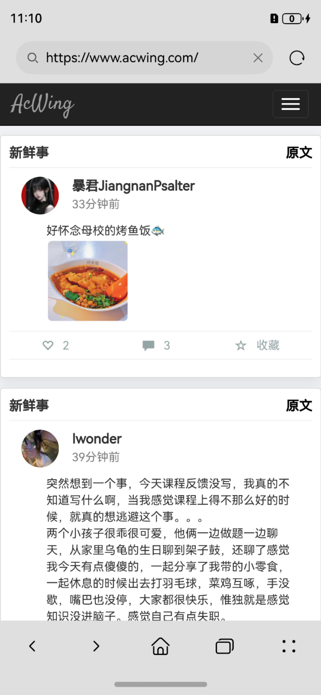
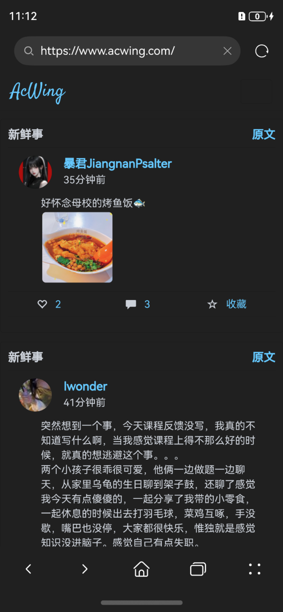
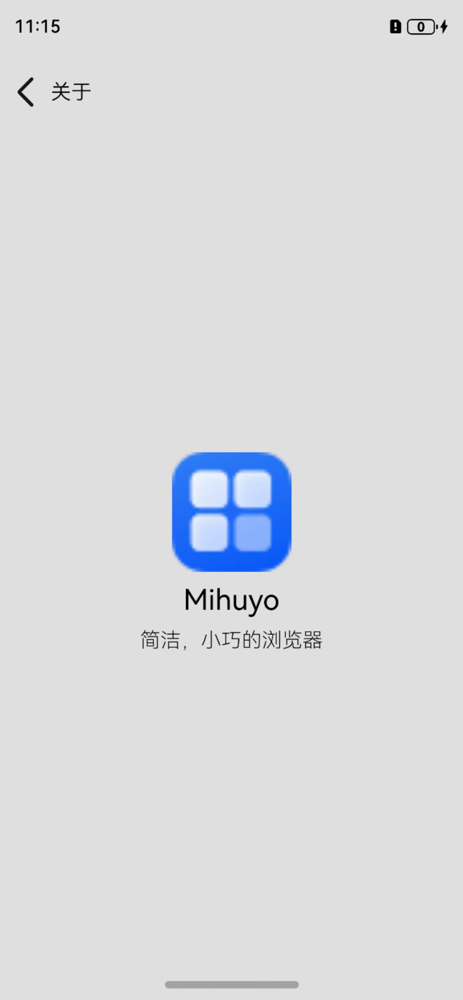

# Mihuyo 浏览器

[简体中文](./README.md) | [English](./README.en.md)

> 一款简洁，小巧的浏览器。

## 首页
|  |   |
|--|--|

## 搜索
|  |   |
|--|--|

## 访问网页
> 通过正则匹配实现

|  |   |
|--|--|

## 关于

## 特性

- [x] 上一页，下一页
- [x] 深色模式（网页通过 JS 注入实现）
- [ ] 多标签页管理