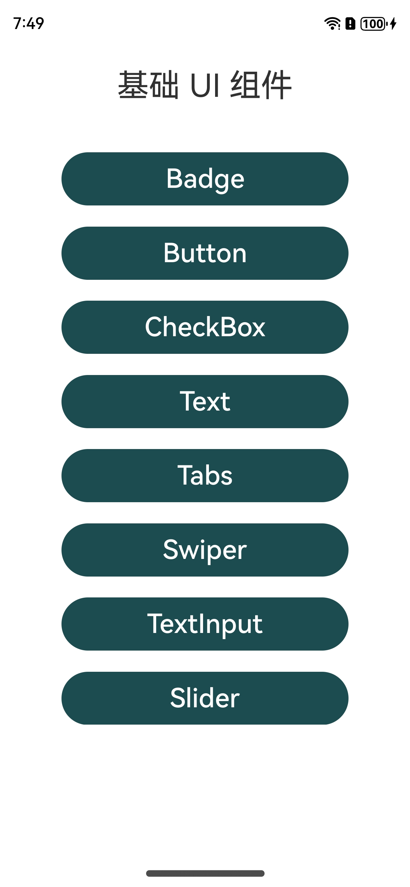
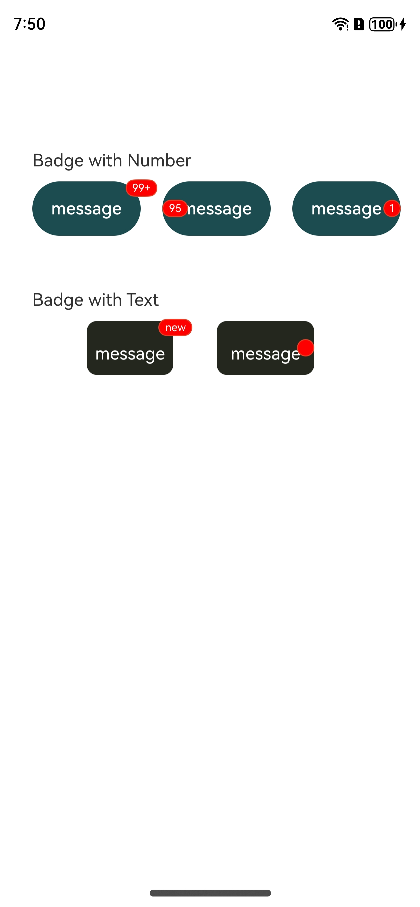
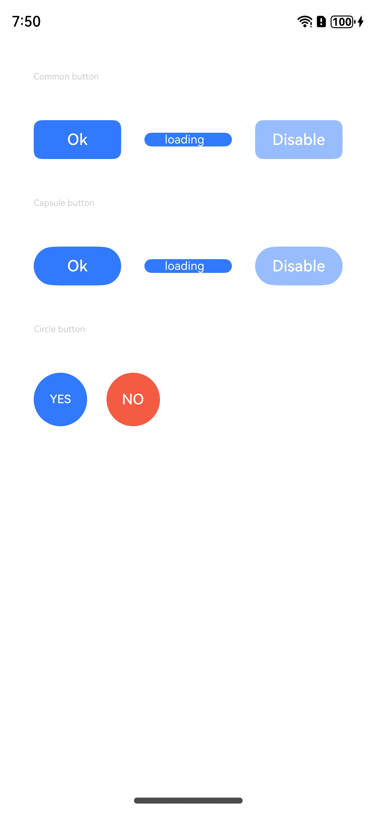
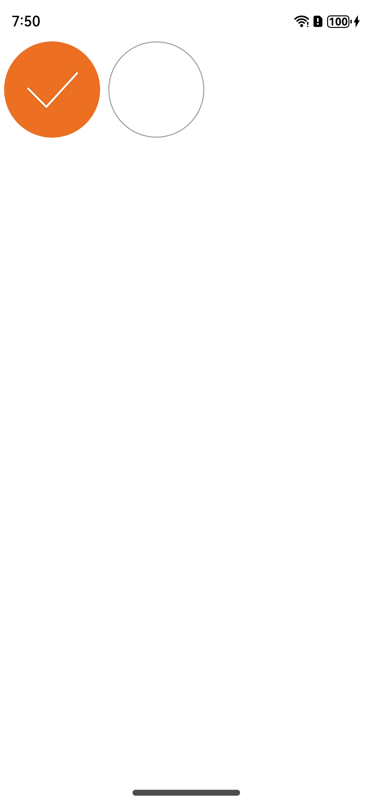
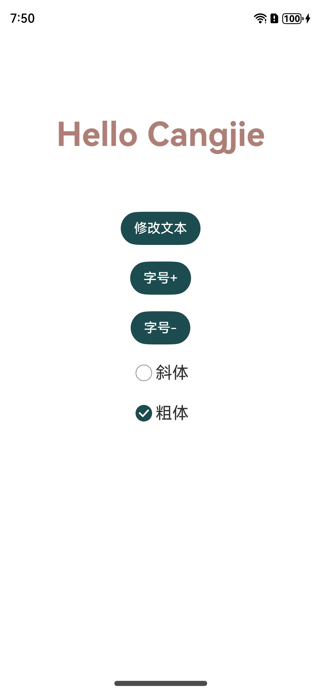
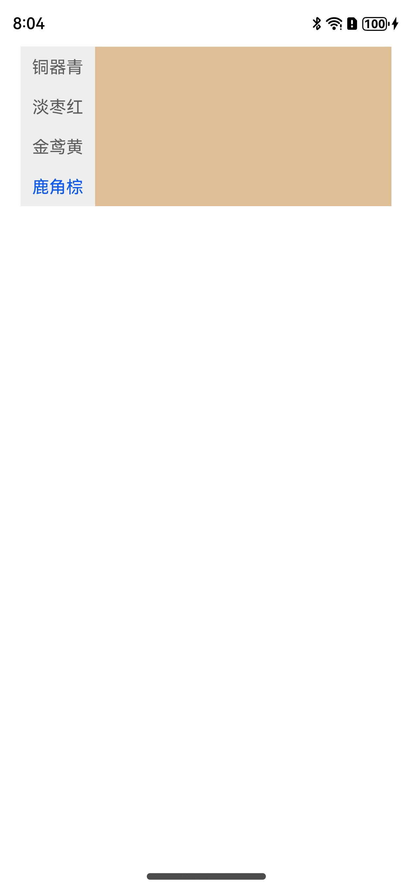
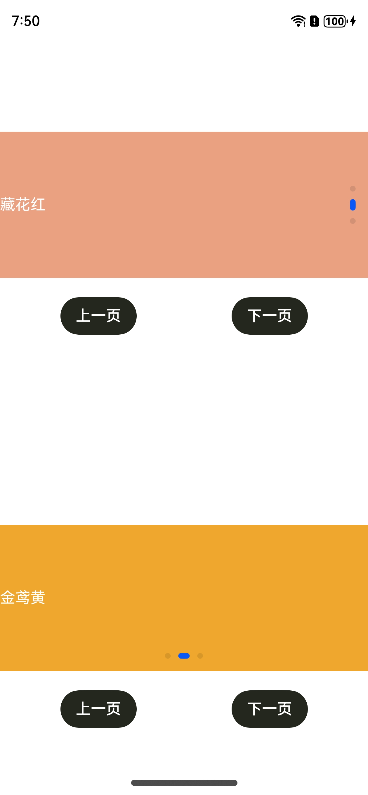
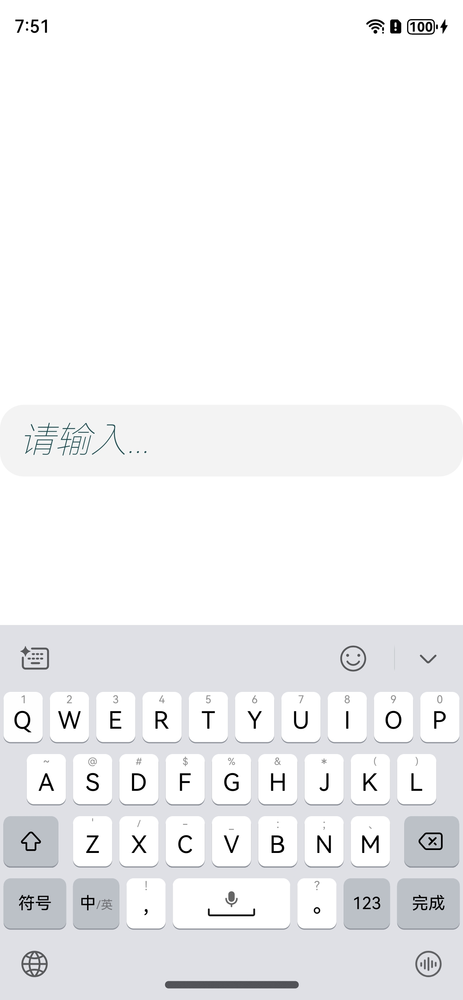
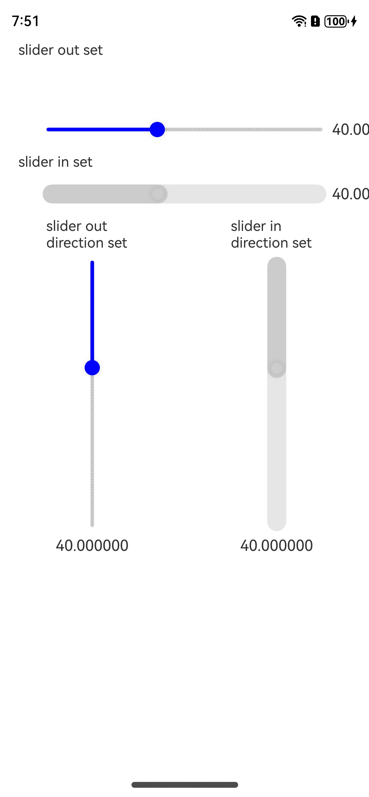

# 基础 UI 组件

> 仓颉语言团队 刘俊杰

### 效果预览

#### 主页面

#### 子页面

| Badge                    | Button                   | CheckBox                 | Text                     |
| ------------------------ | ------------------------ | ------------------------ | ------------------------ |
|  |  |  |  |
| **Tabs**                 | **Swiper**               | **TextInput**            | **Slider**               |
|  |  |  |  |

### 演示内容

示例应用共展示了八种基础 UI 组件：

* Badge: 可以附加在单个组件上用于信息标记的容器组件。
* Button：按钮组件，可快速创建不同样式的按钮。
* CheckBox：多选框组件，通常用于某选项的打开或关闭。
* Text：显示一段文本的组件。
* Tabs：可以通过页签进行内容视图切换的容器组件，每个页签对应一个内容视图。
* Swiper：滑动容器，提供切换子组件显示的能力。
* TextInput：输入文本的控件。
* Slider：滑动条组件，用来快速调节设置值，如音量、亮度等。

### 适配版本

- DevEco: 5.0.5.300
- Cangjie: 0.53.15
- HarmonyOS Next: 5.0.0.112
