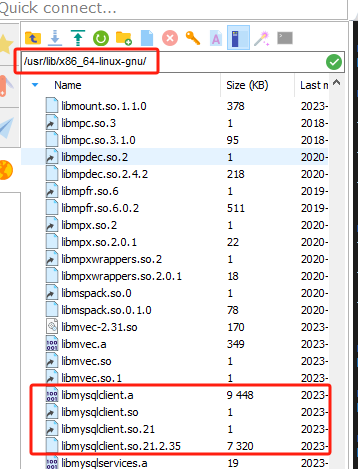
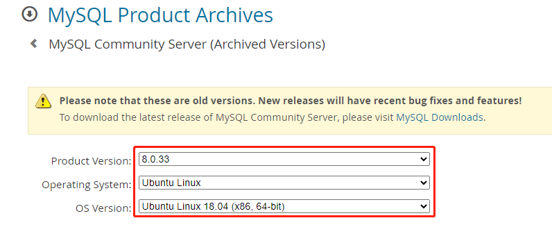
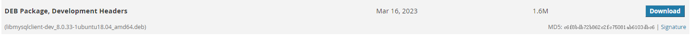

# 编译静态库方法

## 一、获取libmysqlclient.a

### 1、在/usr/lib/x86_64-linux-gnu/路径下获取libmysqlclient.a文件



如果没有.a文件，请运行

```shell
sudo apt-get install libmysqlclient-dev
```

### 2、官网下载编译

官网地址：https://downloads.mysql.com/archives/community/

选择mysql版本和系统



以mysql版本`8.0.33`，系统`Ubuntu Linux 18.04 (x86, 64-bit)`为例，找到以下`libmysqlclient-dev_8.0.33-1ubuntu18.04_amd64.deb`下载



可使用以下网站将`deb`文件解压成`tar`文件

https://www.ezyzip.com/cn-deb.html

将`tar`文件中的`libmysqlclient.a`提取出来使用

## 二、编译项目

linux-x86 环境下运行 build_static_linux.sh 文件

linux-arrch64 环境运行 build_static_aarch64.sh 文件

window 环境下运行 build_static_win.bat 文件

在目录./build/release/mysqlclient/下，最终会生成libmysqlclient_cj.a和libmysqlclient_mysqlclient.a两个静态库.a文件。

## 三、使用

在使用`mysqlclient-ffi`库的项目中，将`libmysqlclient_cj.a`和`libmysqlclient.a`拷贝到当前项目的`lib`目录下，在`module.json`中添加以下选项 "link_option": "-lunwind -lstdc++ -lpthread -ldl -lssl -lcrypto -lresolv -lm -lrt"，并添加相应的`lib`依赖，`module.json`示例如下：


